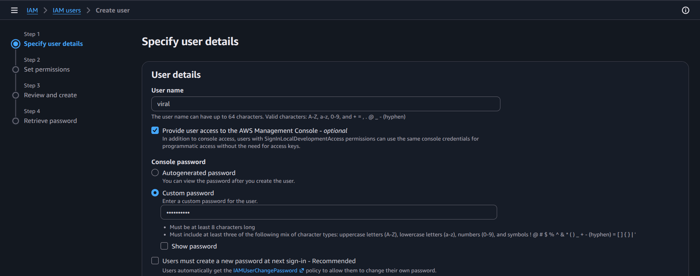
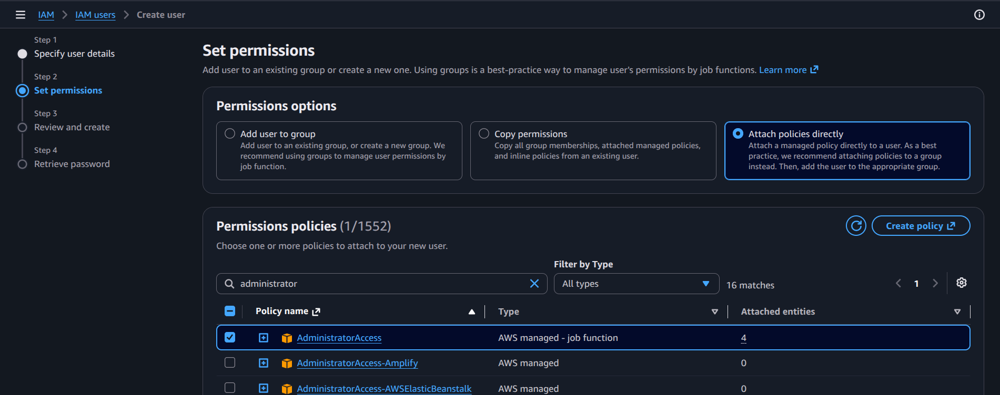
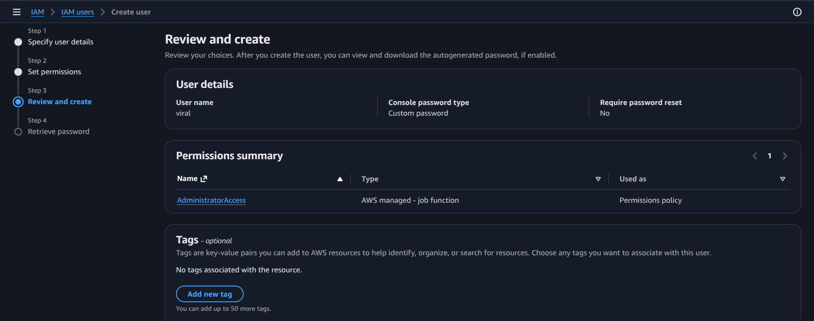
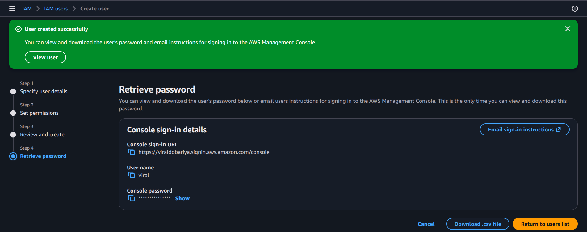

# Practical: Create an IAM User with Admin Permissions for Future Use

## Objective
Create a new IAM user, grant it administrative access, and keep it ready for future AWS tasks.

## Steps performed
1. Open the IAM console and go to Users.
2. Choose Add user and provide a username.
3. Select AWS Management Console access and set a password.
4. Attach the `AdministratorAccess` policy.
5. Review and create the user.
6. Confirm the user appears in the IAM Users list.

## Screenshot walkthrough

## Notes
The user is intended for future admin-level operations. In real-world environments, it is better to follow least-privilege access instead of granting full administrator permissions unless required.
