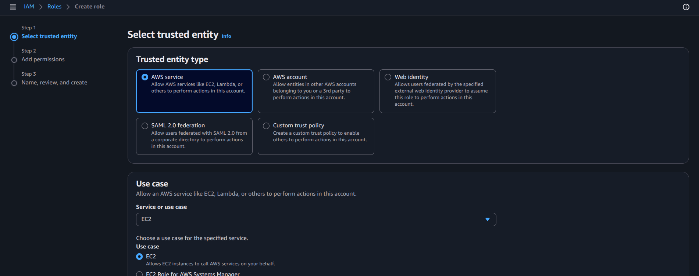
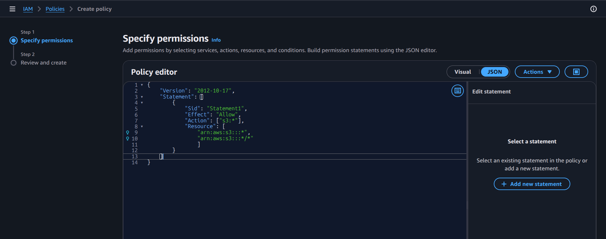
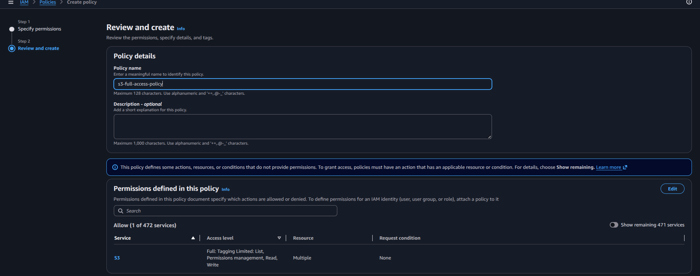
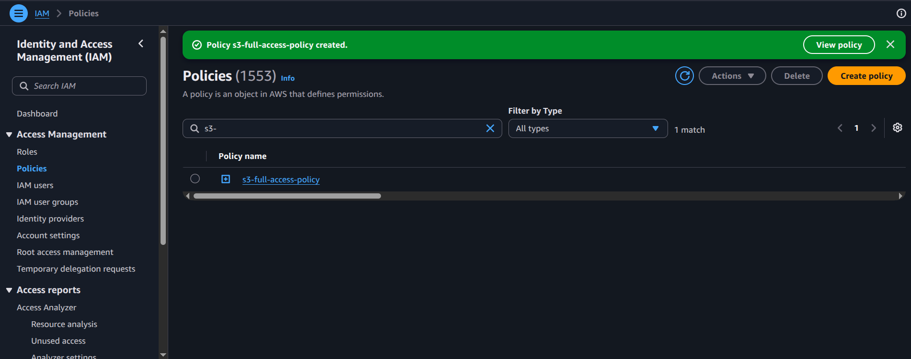
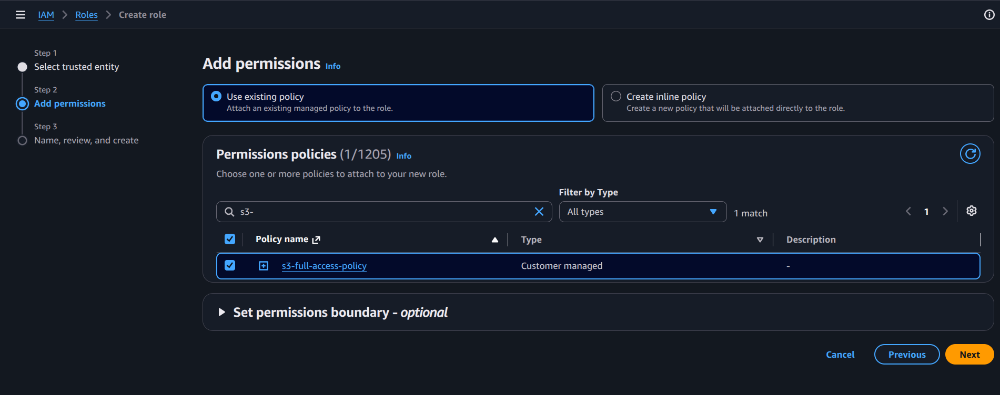
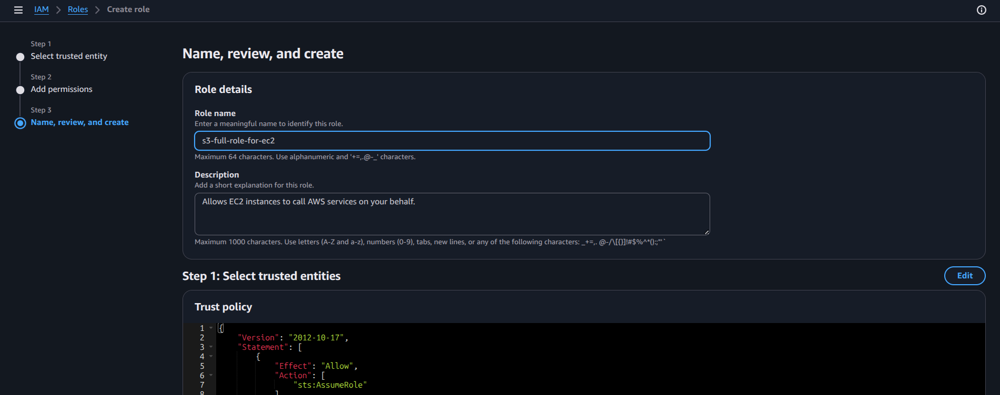

# Practical: Create an EC2 Role and Attach a Custom Policy for Accessing an S3 Bucket

## Objective
Create an IAM role for an EC2 instance so the instance can access an S3 bucket securely without embedding long-term credentials.

## Steps performed
1. Open IAM and create a new role.
2. Select trusted entity type as EC2.
3. Attach a custom inline policy that allows access only to the target S3 bucket.
4. Save the role and note the role ARN.
5. Attach this role to an EC2 instance from the EC2 console.
6. Validate that the instance can access S3 using the role-based permissions.

## Screenshot walkthrough

## Notes
This is a best-practice example of using IAM roles for EC2 instead of static access keys. The policy is scoped to the necessary S3 operations only.
