# Practical: EC2 Instance Setup and Basic Access

## Objective
Launch a basic EC2 instance, configure access parameters, and verify it can be reached through the AWS console and SSH.

## Steps performed
1. Open the EC2 dashboard and choose Launch instance.
2. Choose an Amazon Machine Image and instance type.
3. Create or select a key pair for SSH authentication.
4. Configure the security group to allow necessary inbound traffic.
5. Launch the instance and wait for it to become running.
6. Connect to the instance using the chosen key pair and verify the system is reachable.

## Screenshot walkthrough

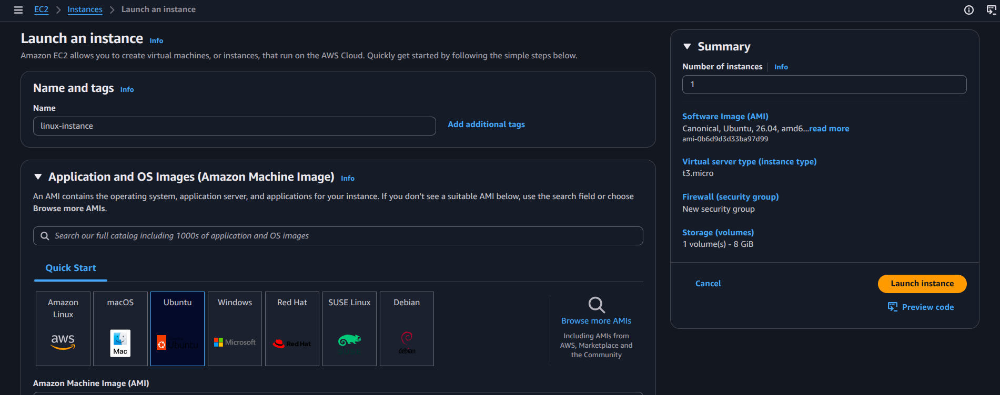

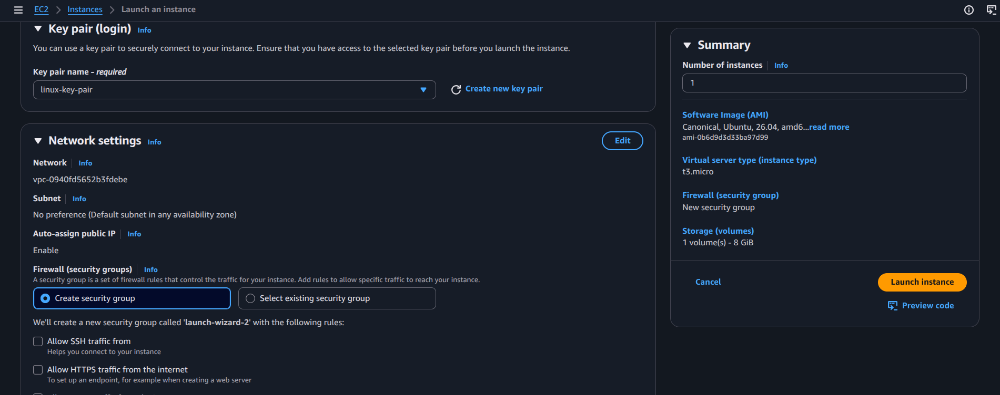

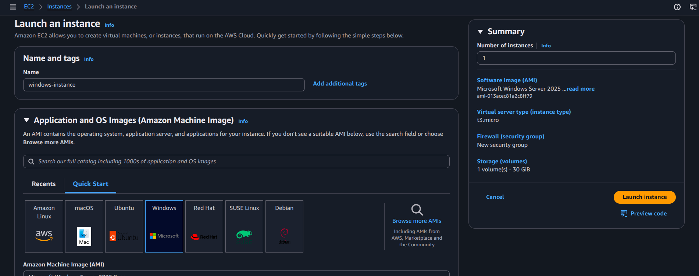

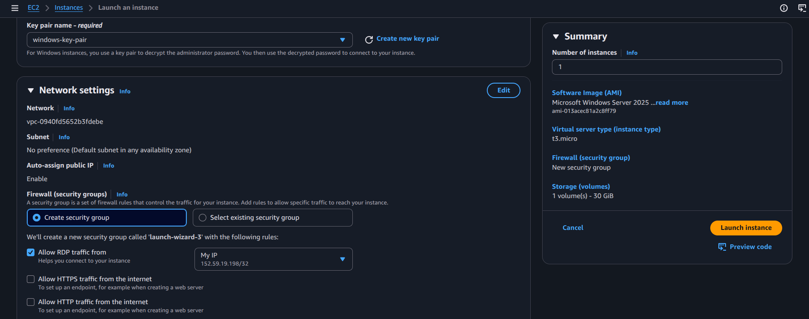

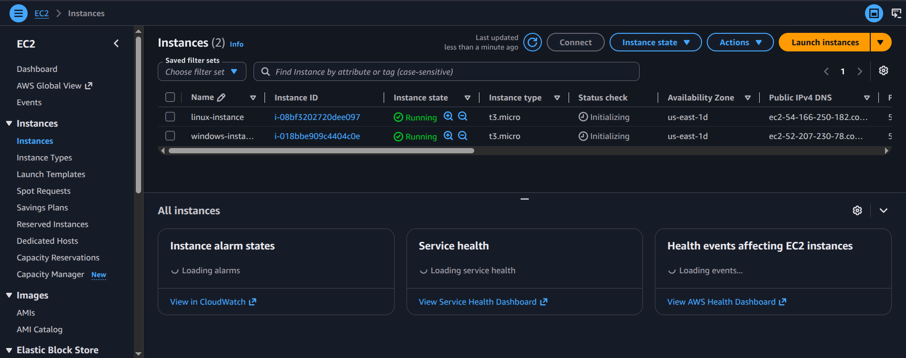

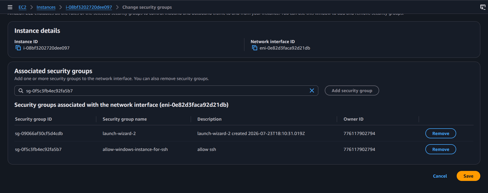

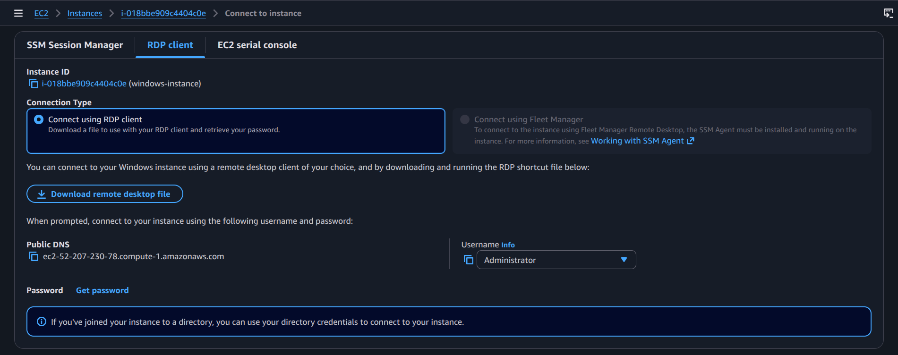

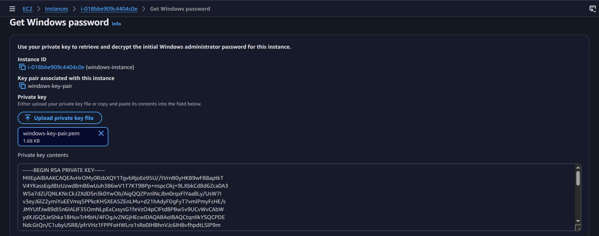

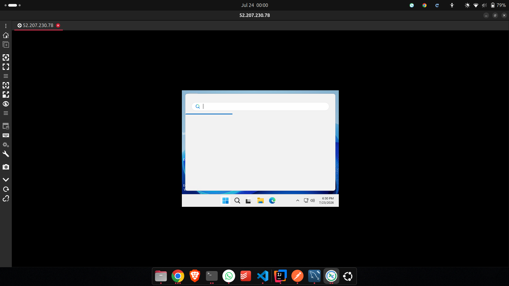

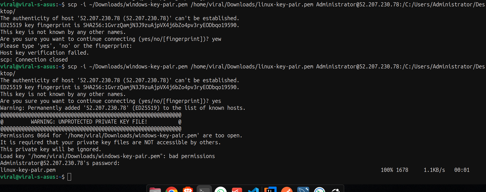

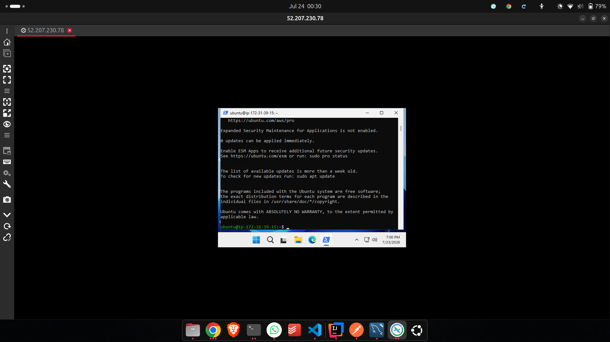

## Notes
This practical represents the standard EC2 launch workflow: selecting the AMI, choosing instance type, configuring networking, setting access rules, and validating the new instance.
