# Practical: Auto Scaling and Load Balancing

## Objective
Create a highly available web solution using an Application Load Balancer and an Auto Scaling Group.

## Steps performed
1. Create a target group and application load balancer.
2. Configure the load balancer listener and health checks.
3. Create an Auto Scaling Group with launch configuration or launch template.
4. Attach the target group to the Auto Scaling Group.
5. Configure scaling policies to add and remove instances based on demand.
6. Verify the load balancer and instances are healthy.

## Screenshot walkthrough

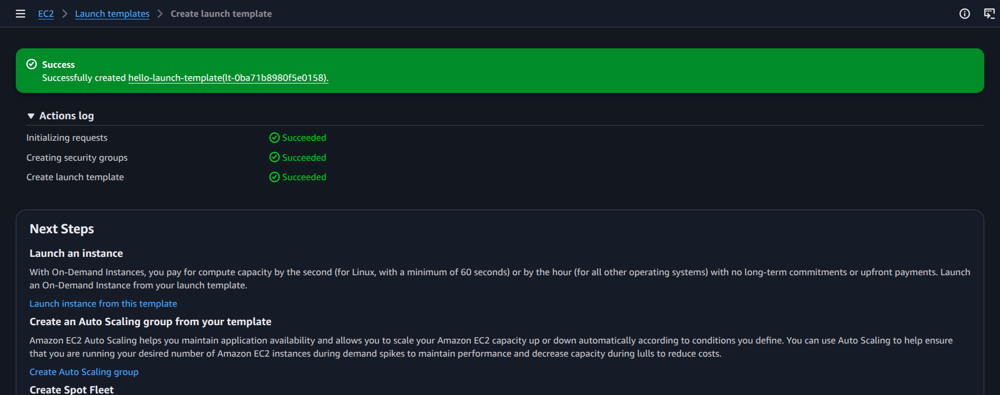

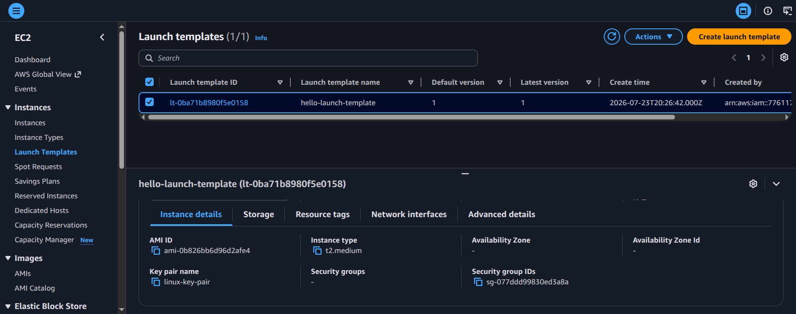

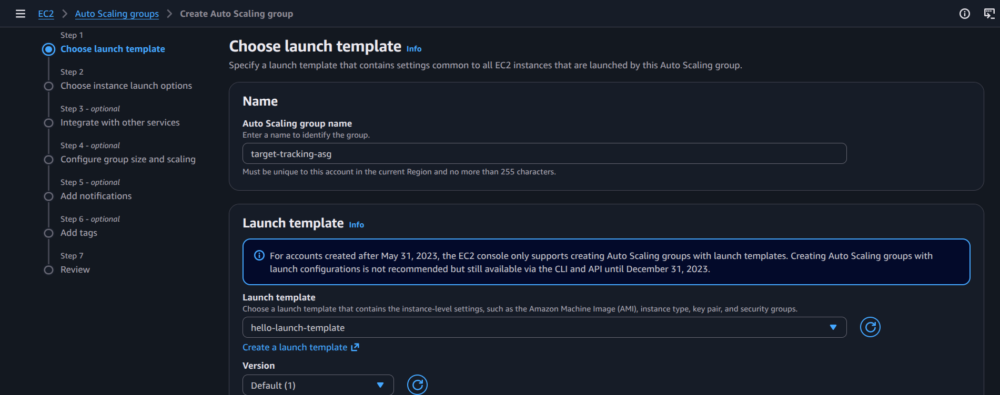

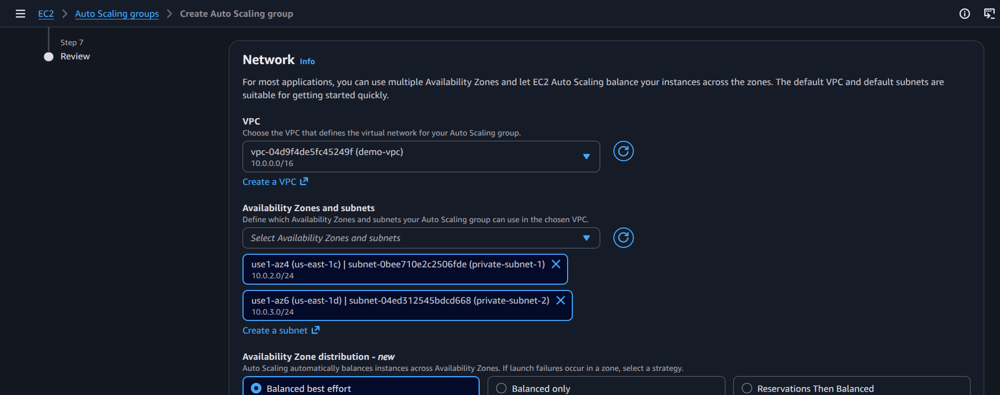

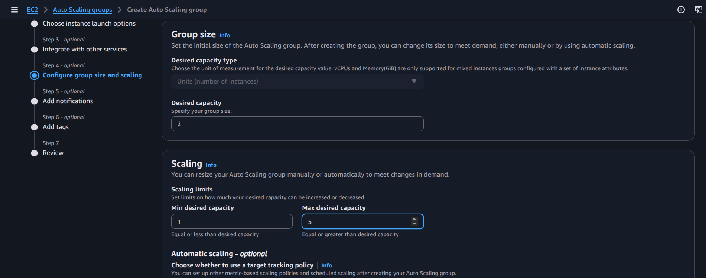

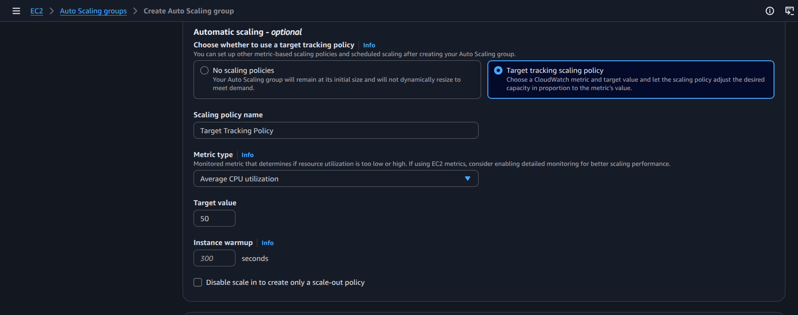

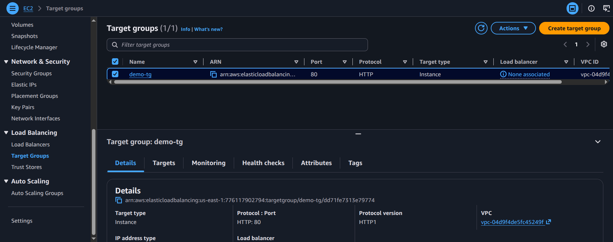

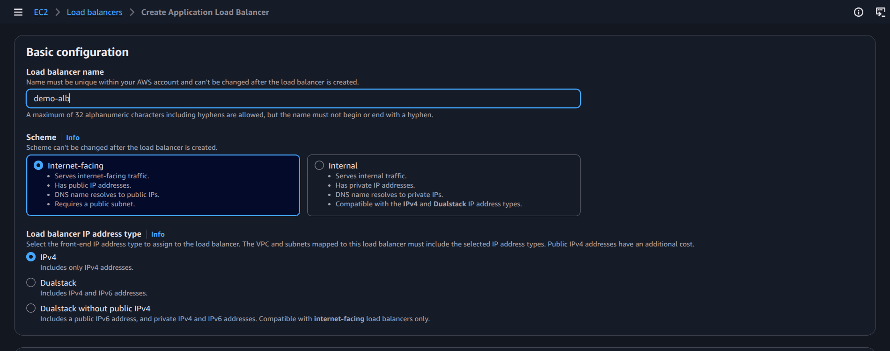

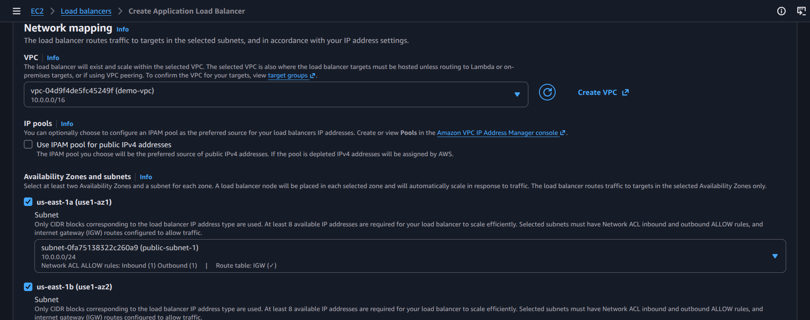

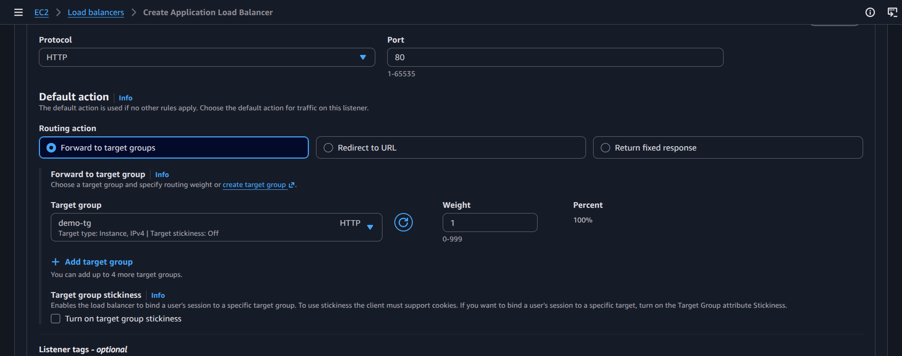

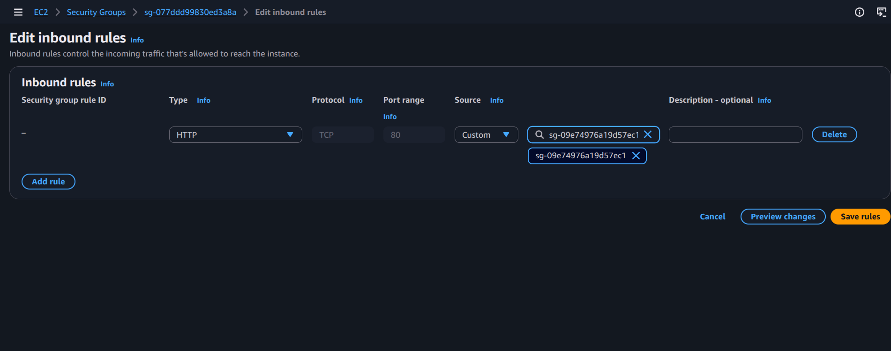

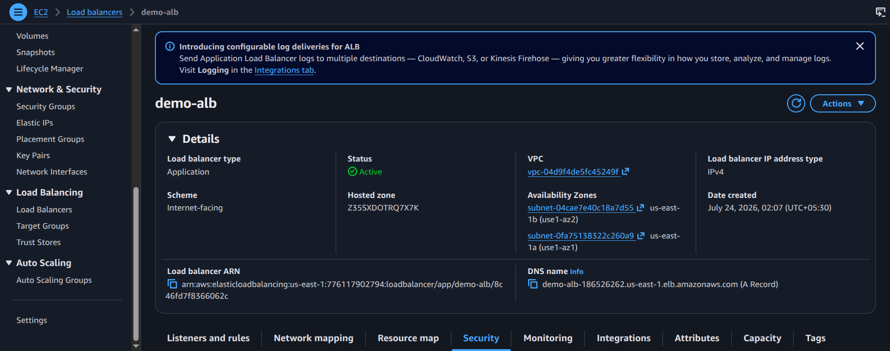

## Notes
The purpose of this practical is to show how AWS distributes traffic across multiple EC2 instances and automatically scales them based on demand using ASG and ALB.
