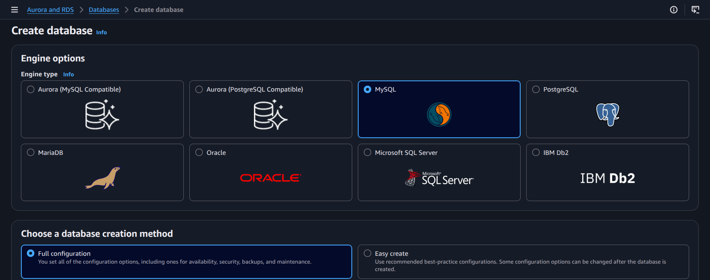
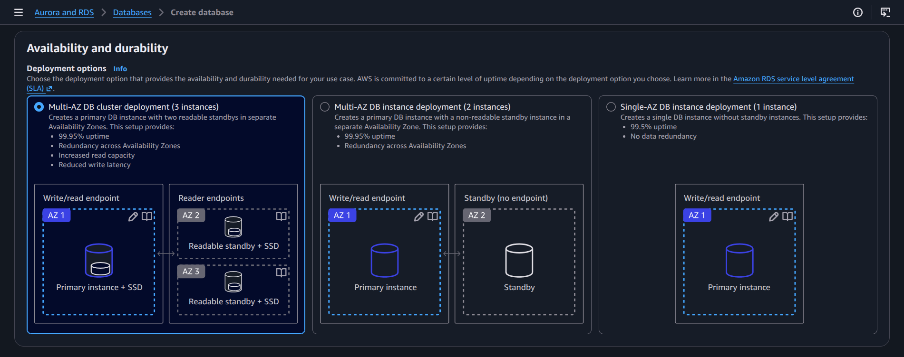
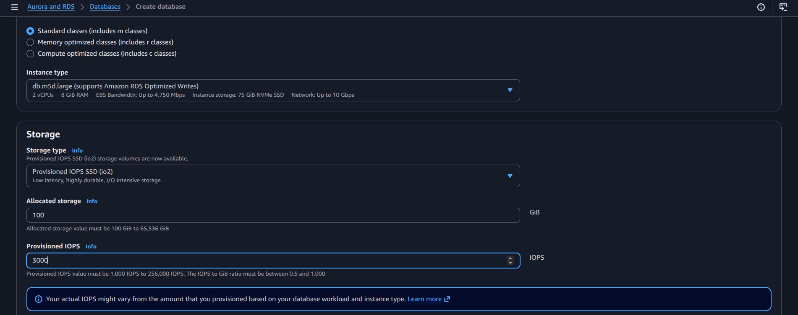
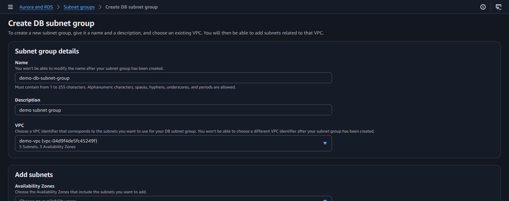
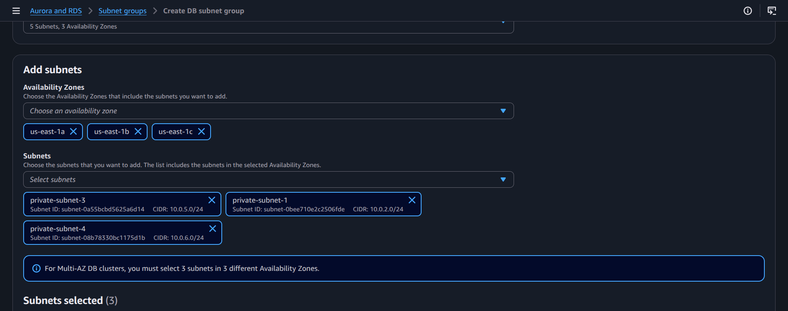
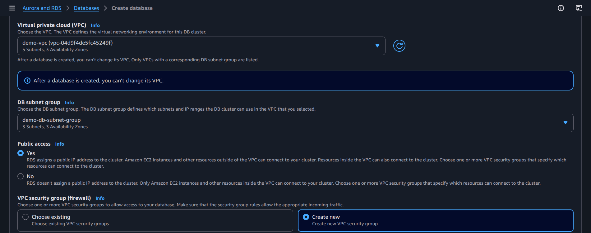
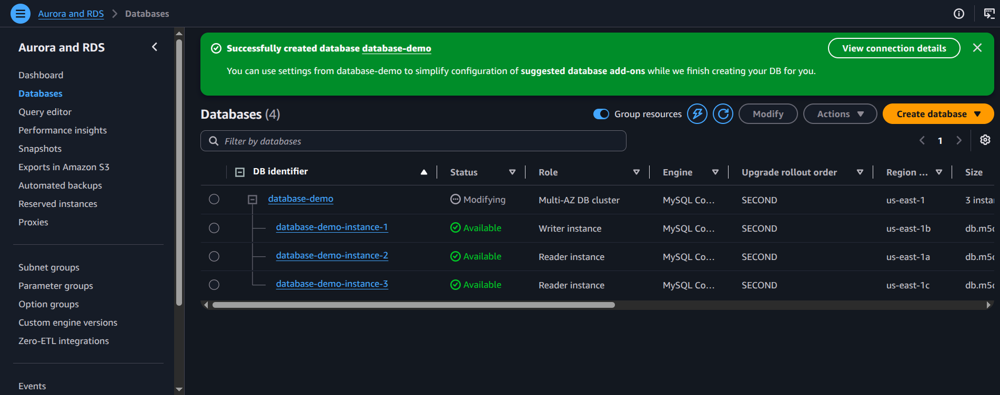
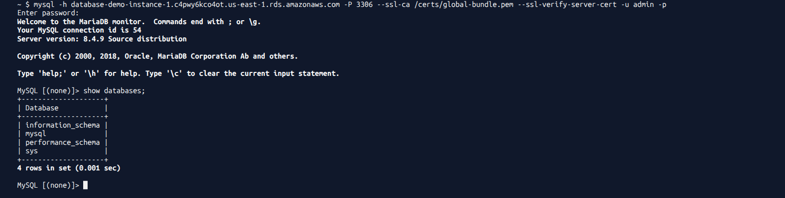

# Practical: Create and Configure an RDS Instance

## Objective
Launch an RDS database instance, configure networking and security, and prepare it for application use.

## Steps performed
1. Open the RDS console and choose Create database.
2. Select the database engine and instance class.
3. Configure database credentials, storage, and backup settings.
4. Create or choose a VPC subnet group and security group.
5. Configure public accessibility and database port access as needed.
6. Launch the database, wait for availability, and verify the final endpoint.

## Screenshot walkthrough

## Notes
This practical demonstrates the core RDS provisioning flow, including engine selection, security configuration, and endpoint validation.
