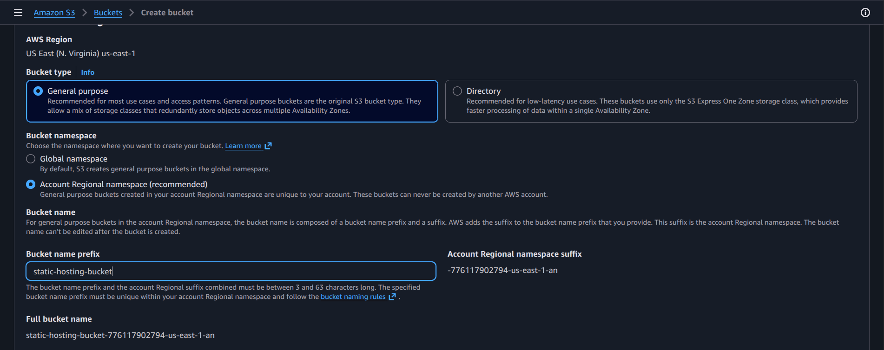
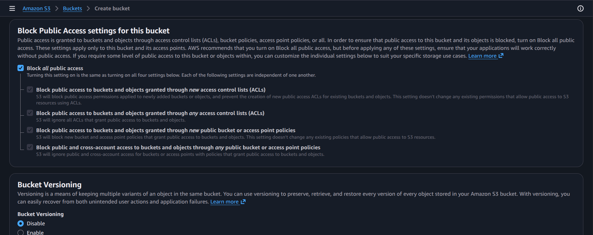
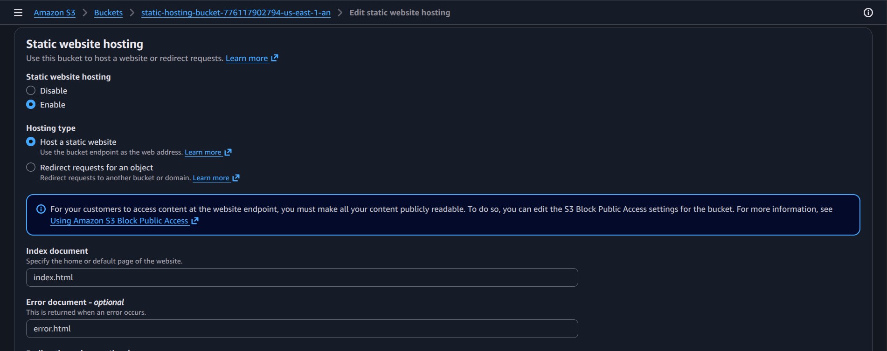
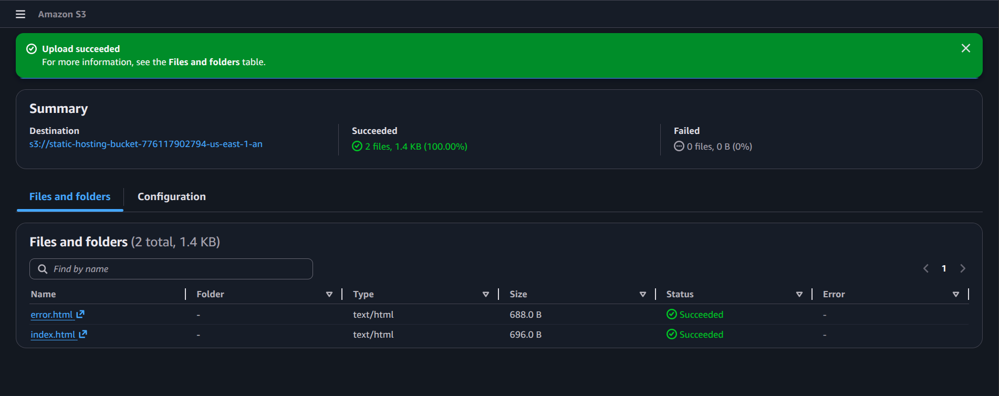
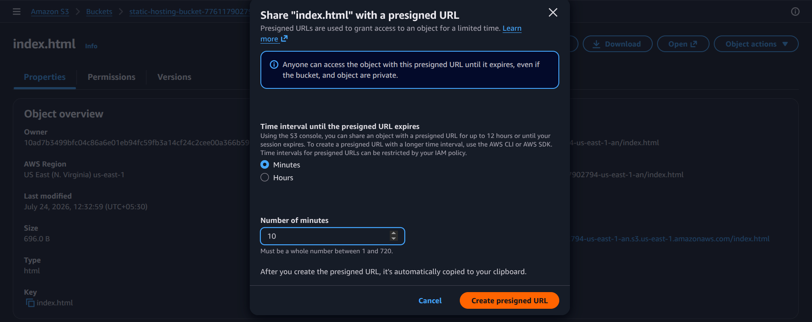
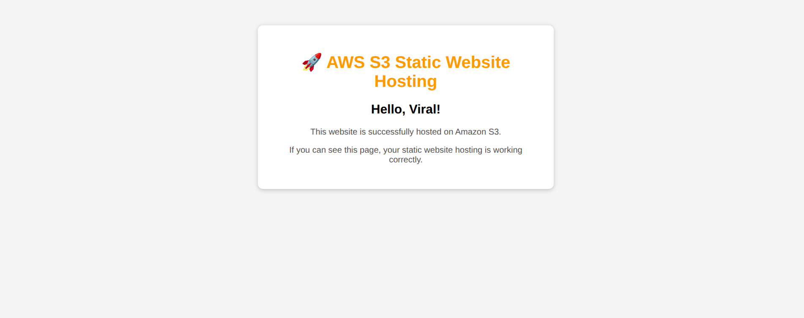

# Practical: Create and Manage an S3 Bucket

## Objective
Create an S3 bucket, configure access settings, and understand how AWS object storage can be used for secure file storage.

## Steps performed
1. Open the S3 console and choose Create bucket.
2. Set a unique bucket name and region.
3. Configure bucket settings such as versioning and public access block.
4. Create the bucket and verify it appears in the bucket list.
5. Upload a sample object and review its properties.

## Screenshot walkthrough

## Notes
This practical focuses on the basic S3 storage workflow: provisioning a bucket, controlling access, and managing objects inside it.
