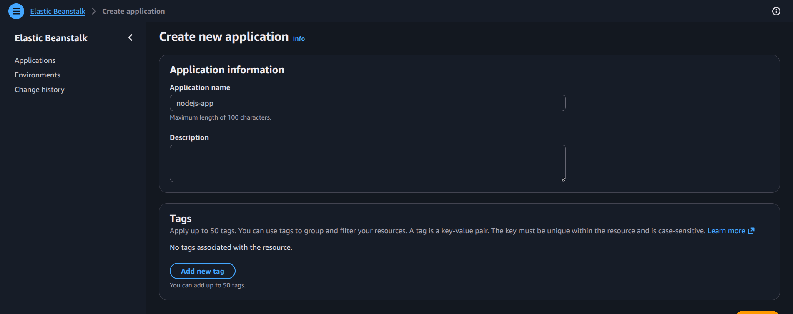
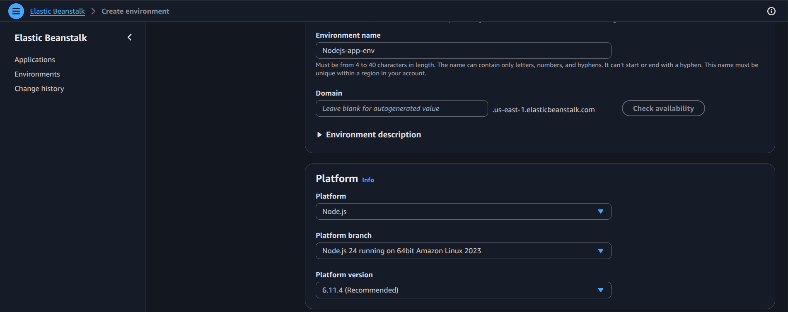
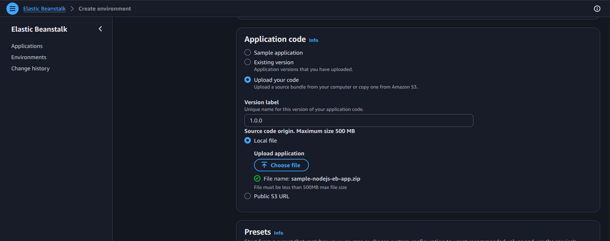
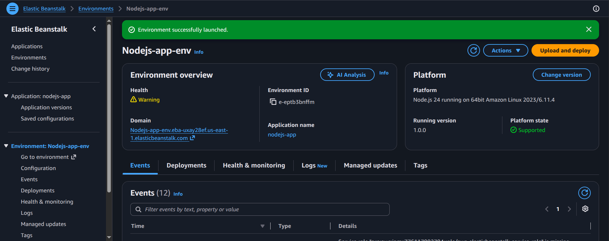
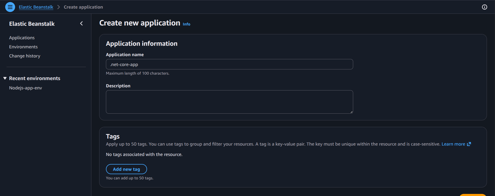
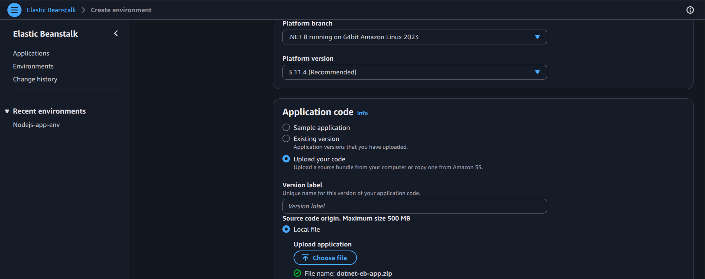
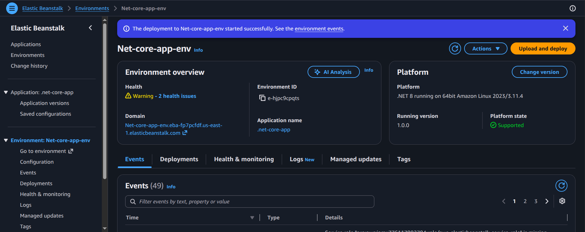
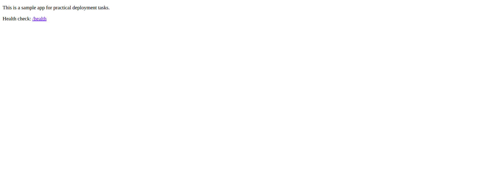

# Practical: Deploy an Application Using Elastic Beanstalk

## Objective
Use AWS Elastic Beanstalk to deploy a sample application with minimal infrastructure management.

## Steps performed
1. Open Elastic Beanstalk and choose Create application.
2. Choose the application platform and runtime.
3. Upload the application code package.
4. Configure environment settings, such as instance type and service role.
5. Create the environment and wait for health checks to pass.
6. Review the environment URL and deployment status.

## Screenshot walkthrough

## Notes
Elastic Beanstalk simplifies deployment by handling the underlying compute, load balancing, and scaling resources for a web application.
