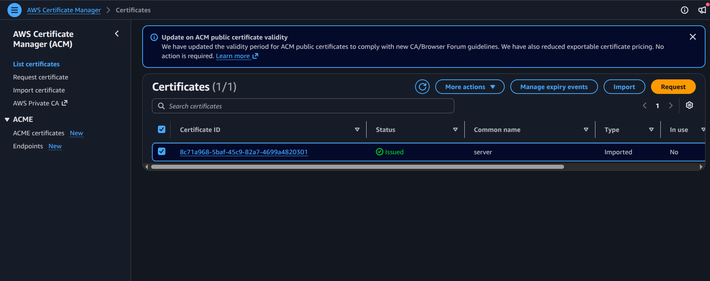
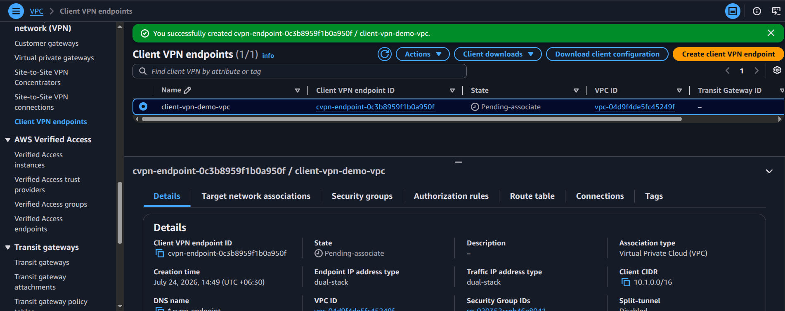
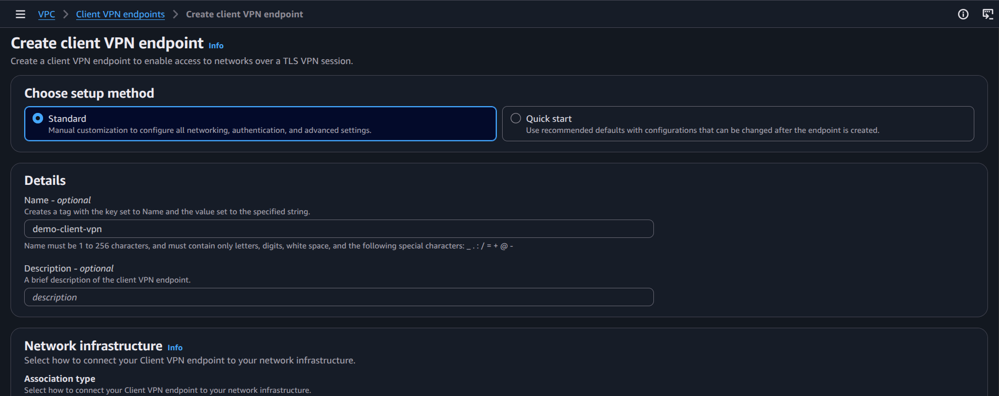
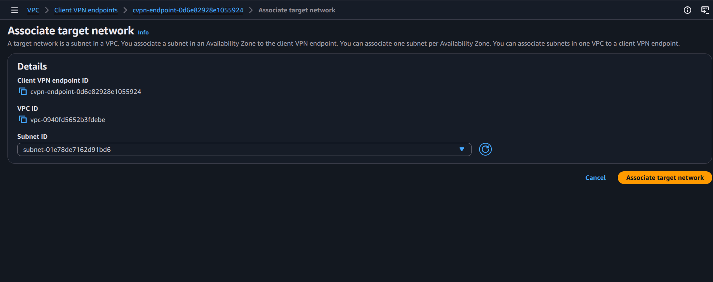
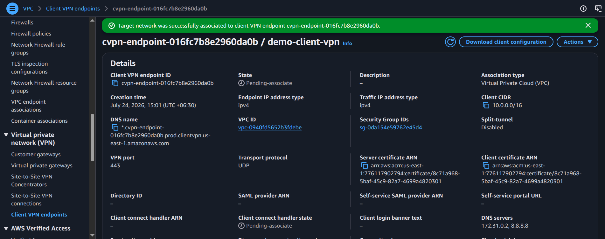
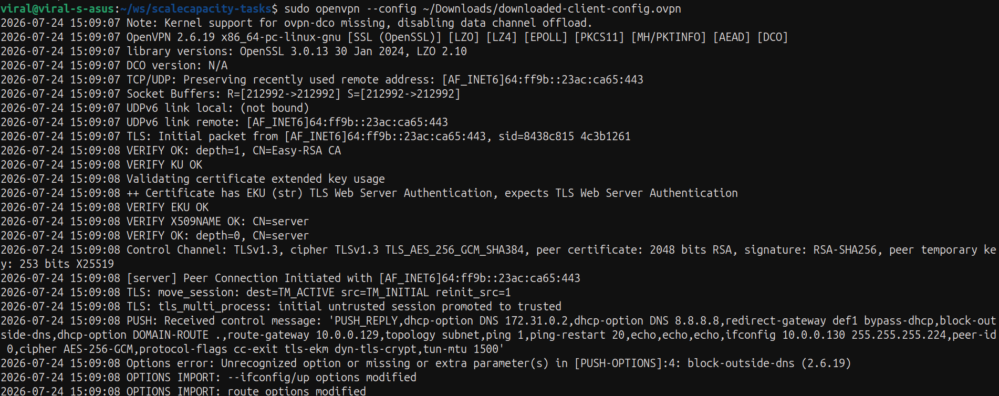

# Practical: Implement Client VPN

## Objective
Create a Client VPN endpoint in AWS VPC so remote users can securely connect to private network resources.

## Steps performed
1. Open the VPC console and go to Client VPN endpoints.
2. Create a new endpoint and define the associated CIDR range.
3. Configure authentication, split-tunnel settings, and authorization rules.
4. Associate the endpoint with a VPC subnet and security settings.
5. Download or share the client configuration and verify endpoint status.

## Screenshot walkthrough

## Notes
Client VPN is used to provide secure remote access to AWS resources without exposing the entire VPC to the internet.
