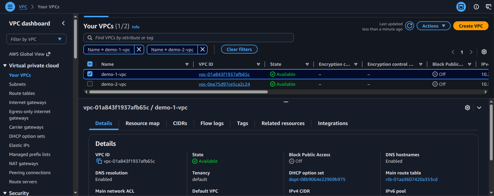
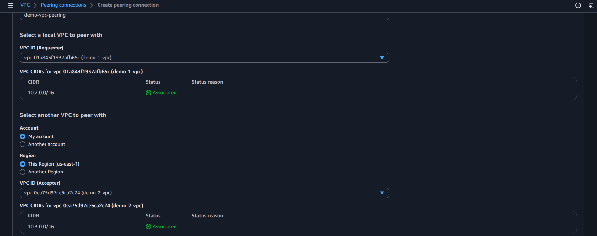
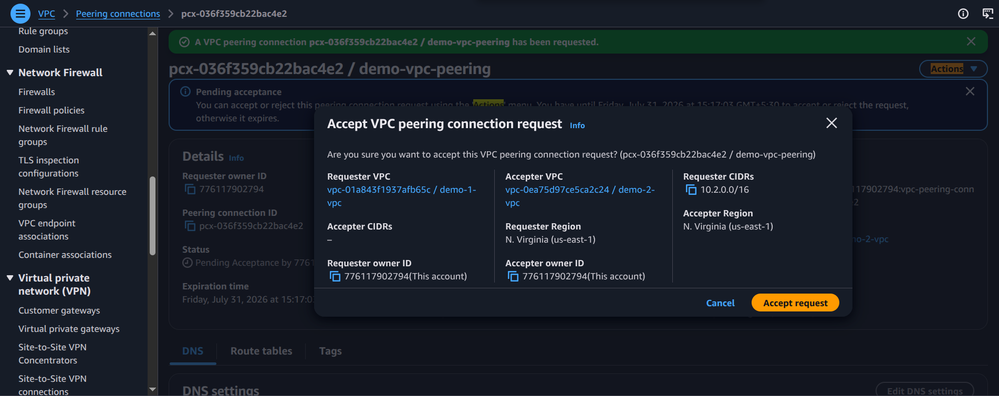
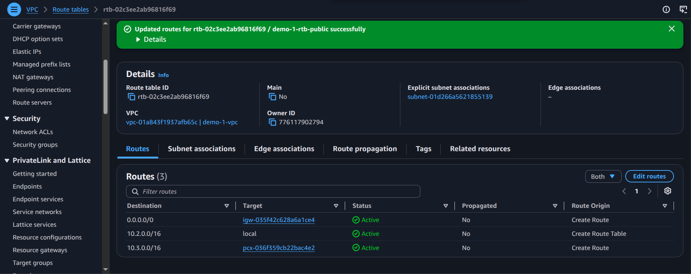
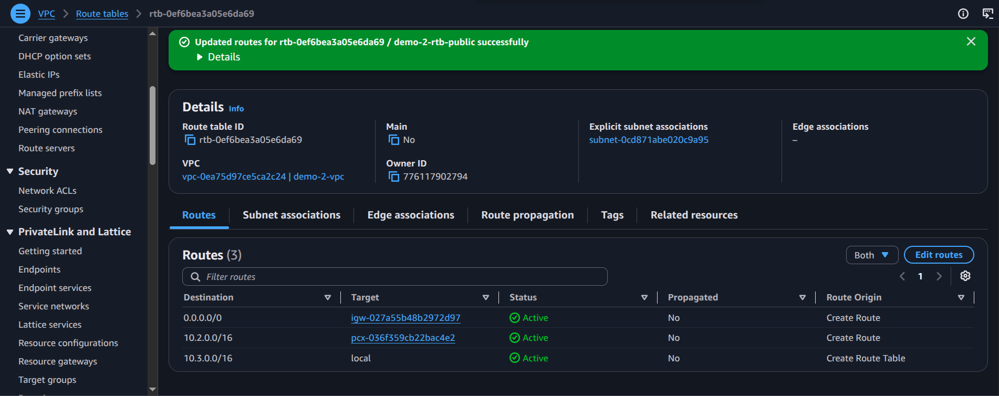

# Practical: Configure Two Separate VPCs and Establish VPC Peering

## Objective
Set up two isolated VPCs and connect them through a VPC peering connection so they can communicate privately.

## Steps performed
1. Create two VPCs with separate CIDR ranges.
2. Add subnets and route tables in each VPC.
3. Configure the required network ACL and security group rules.
4. Create a VPC peering connection between the two VPCs.
5. Accept the peering request and update route tables in both VPCs.
6. Verify private connectivity between resources across the peered VPCs.

## Screenshot walkthrough

## Notes
This practical demonstrates network isolation and inter-VPC communication using route table updates and a peering connection.
