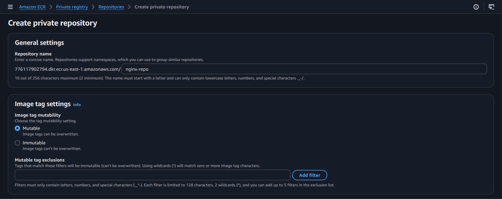
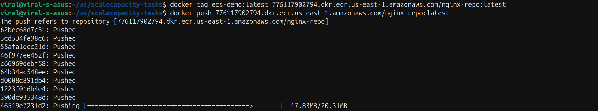
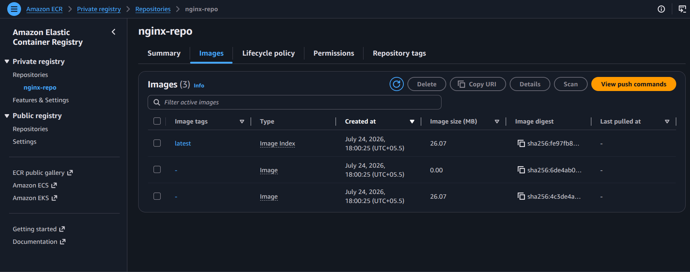
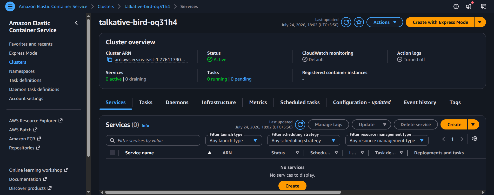
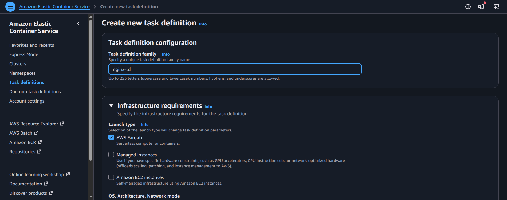
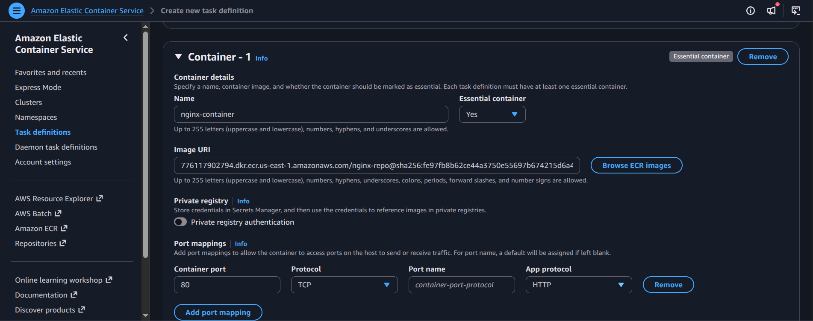
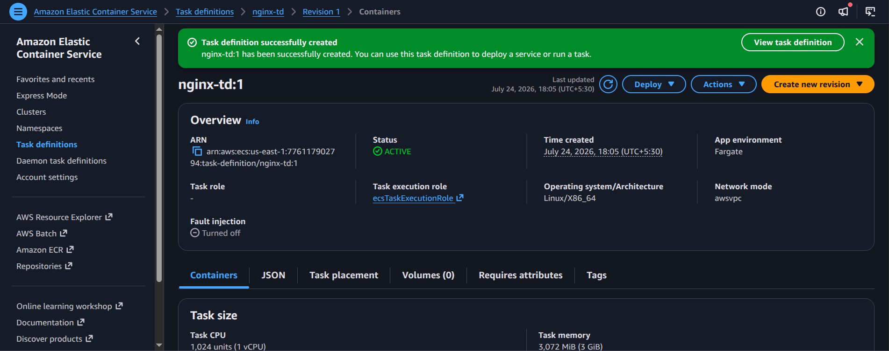
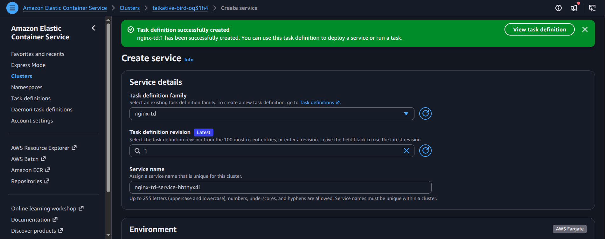
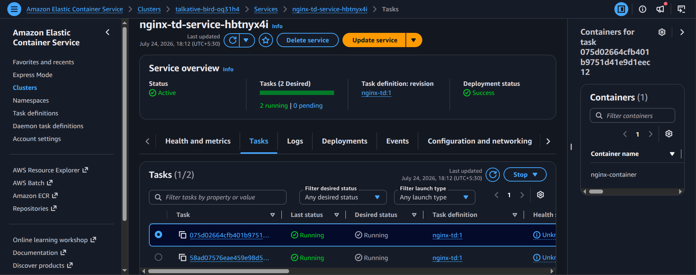

# Practical Assignment: Deploy a Sample Web Application on ECS with Secure Access to a Container Registry

## Objective
Deploy an application on Amazon ECS, store the container image in Amazon ECR, and connect the service securely while preserving container registry access control.

## Likely implementation flow
1. Create an ECR repository to store the application image.
2. Build or push the container image into ECR.
3. Create an ECS cluster and task definition for the service.
4. Configure security groups and IAM roles required by the ECS service.
5. Launch the ECS service and expose it through a load balancer or service endpoint.
6. Verify that the application is reachable and that the registry access is properly managed.

## Screenshot walkthrough

## Notes
This assignment combines ECS, ECR, IAM, and networking to demonstrate a containerized deployment workflow with secure registry access.
