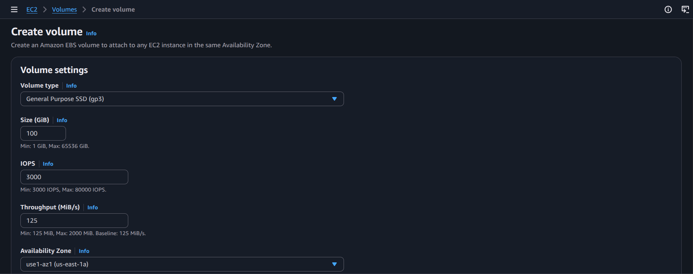
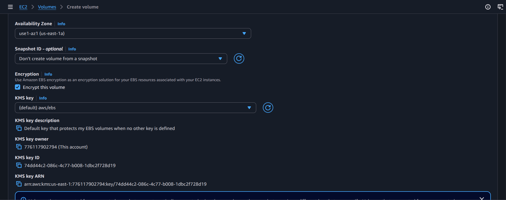
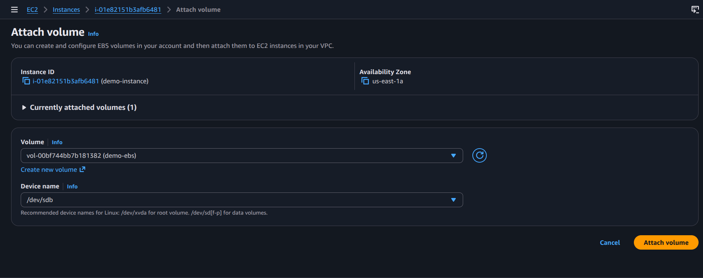
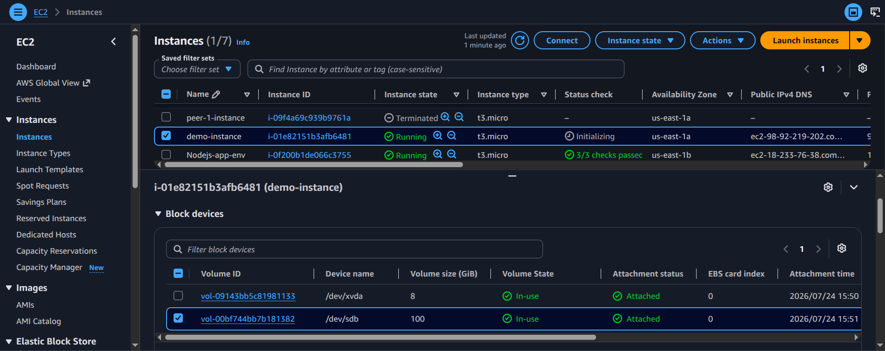

# Practical: Create an EBS Volume and Attach It to an EC2 Instance

## Objective
Create an Elastic Block Store volume and attach it to an existing EC2 instance for additional persistent storage.

## Steps performed
1. Open the EC2 console and create a new EBS volume.
2. Choose the availability zone that matches the target EC2 instance.
3. Create the volume and note its ID.
4. Attach the volume to the selected EC2 instance.
5. Log in to the instance and format/mount the volume if needed.
6. Verify that the attached storage is available for use.

## Screenshot walkthrough

## Notes
EBS provides persistent block storage for EC2 instances and is commonly used for databases, application data, and system volumes.
