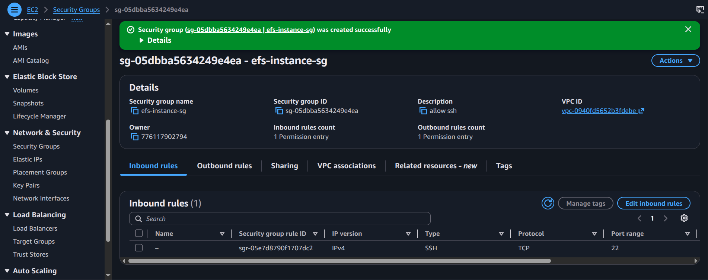
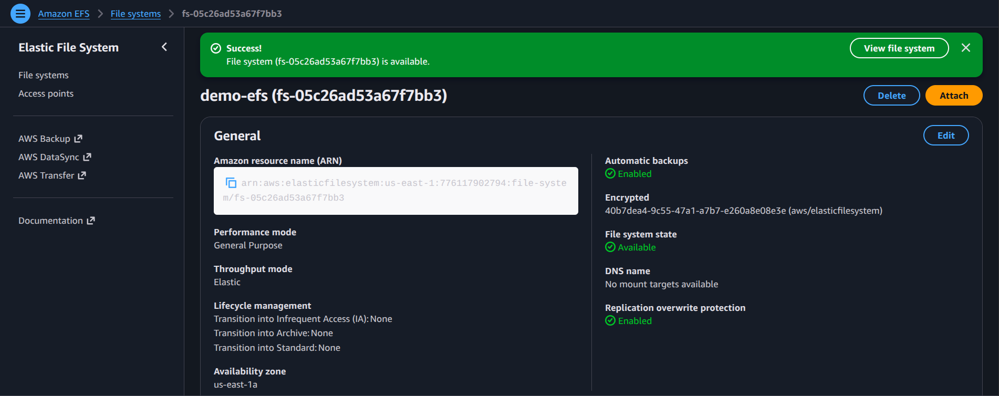
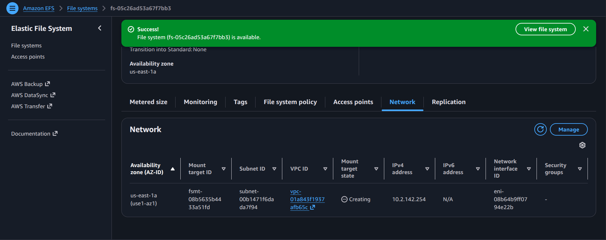
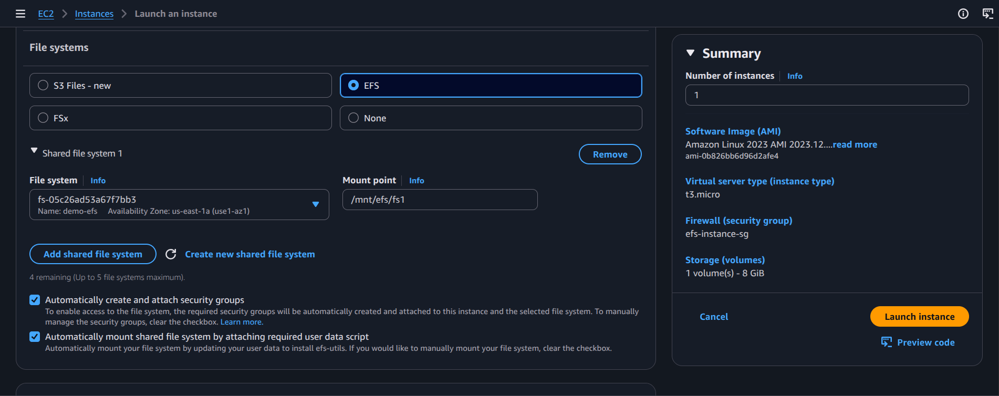
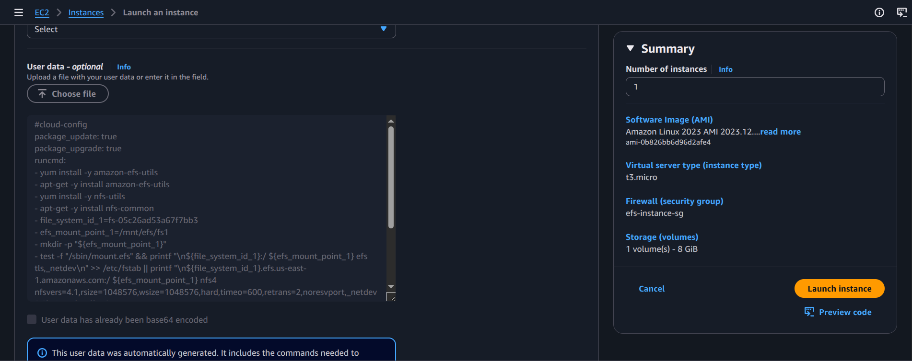

# Practical: Create an EFS File System and Attach It to Multiple Instances

## Objective
Set up an Amazon EFS file system and mount it on multiple EC2 instances to share data across instances.

## Steps performed
1. Open the EFS console and create a new file system.
2. Configure mount targets in the selected VPC subnets.
3. Ensure the security group allows NFS traffic.
4. Launch or use EC2 instances in the same VPC.
5. Install the NFS client utilities on the instances.
6. Mount the EFS file system on each instance and verify shared access.

## Screenshot walkthrough

## Notes
EFS is a managed shared file system designed for multiple EC2 hosts that need access to the same persistent data directory.
