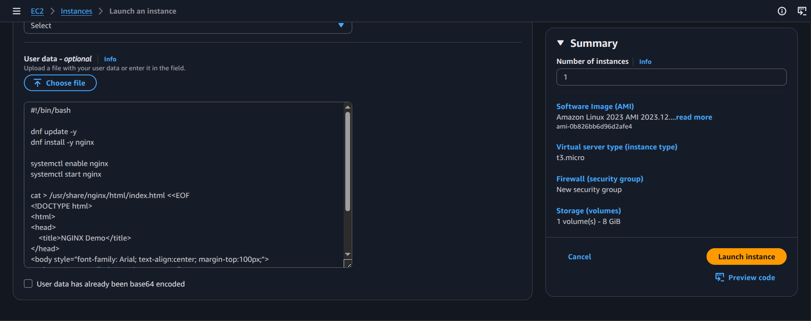
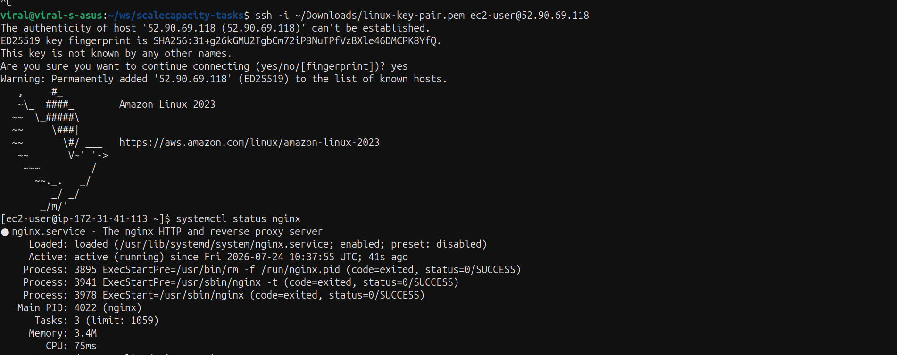
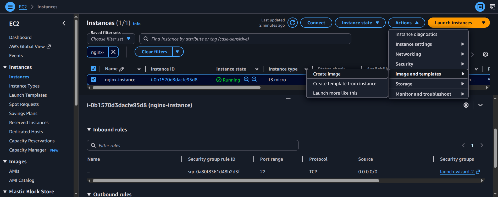
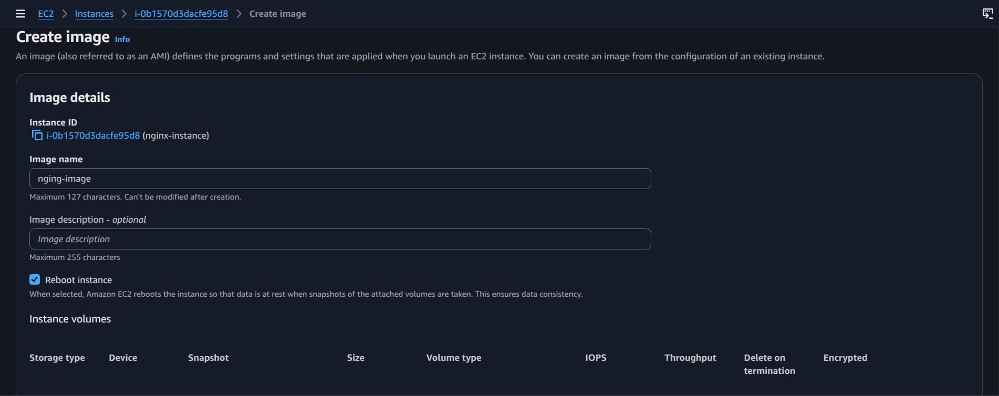
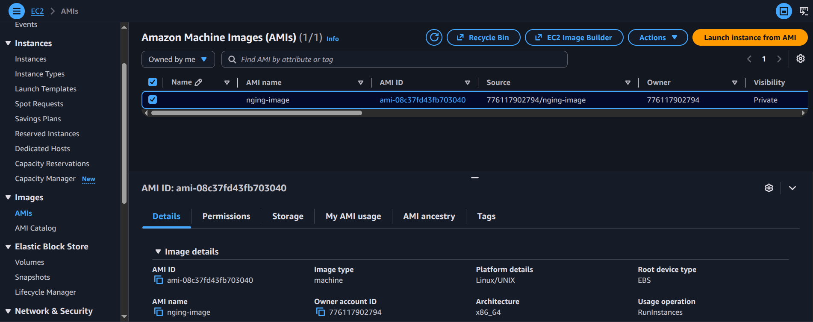

# Practical: Install NGINX on an Instance Using EC2 User Data and Create an AMI

## Objective
Use EC2 user data to automatically install NGINX on a new Linux instance and then create a reusable AMI from that configured instance.

## Steps performed
1. Launch an EC2 instance with a Linux AMI.
2. Provide user data script to install and start NGINX.
3. Wait for the instance to initialize and confirm NGINX is running.
4. Create an AMI from the configured instance.
5. Verify the AMI is available for reuse.

## Screenshot walkthrough

## Notes
EC2 user data is a convenient way to automate instance configuration during first boot. Creating an AMI helps standardize future deployments from a known-good image.
